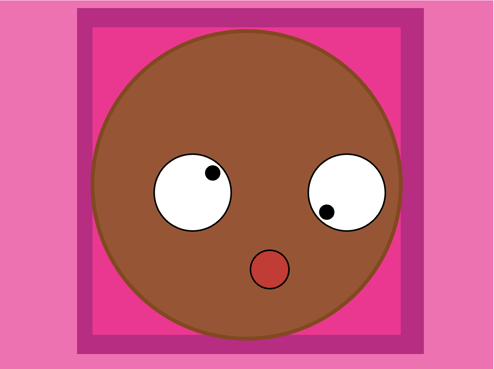
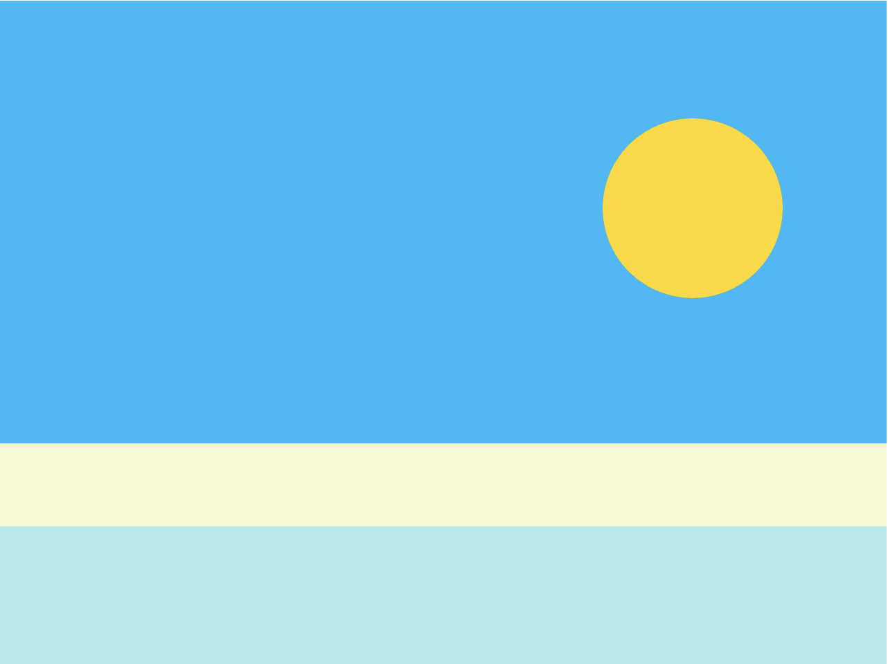
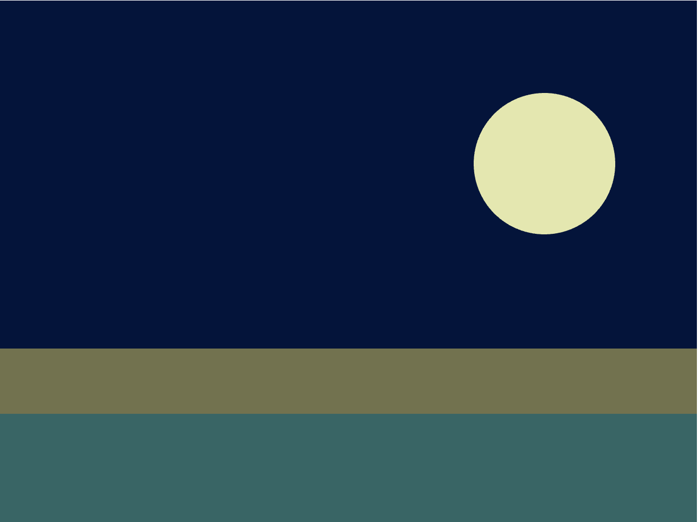
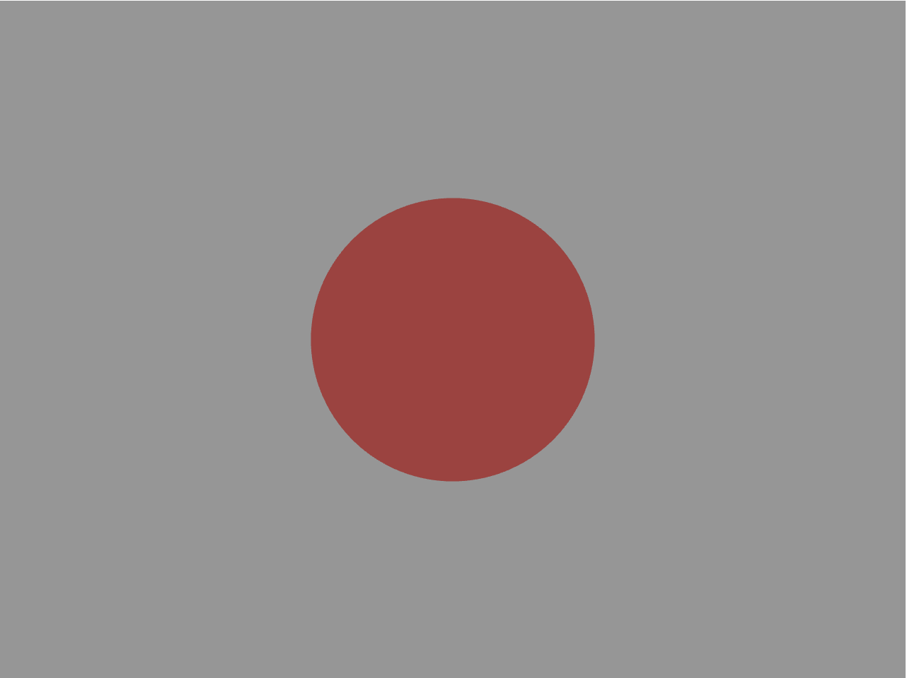
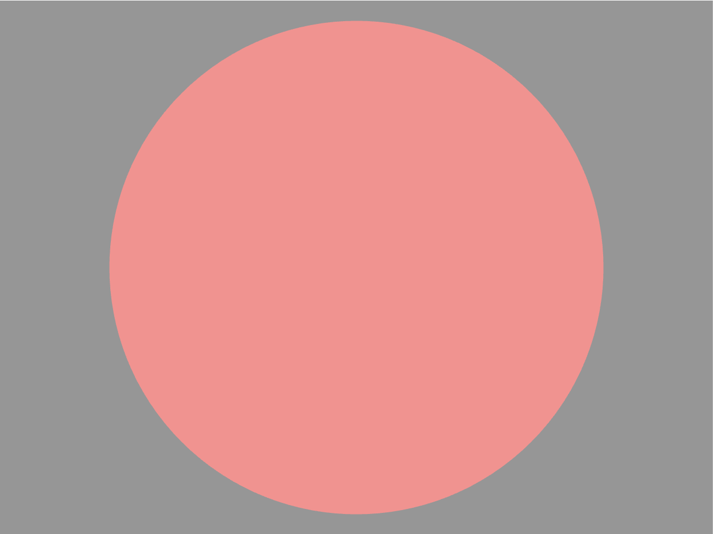

# cart253

# Welcome to my DIMENSION
Hello, I'm Mariam-Choukri Mahdi, an student in Computation Art program.
 
**It's not my first time doing coding but this time will be the right one.** 

This website is for presenting me : my personality, my life and my dreams. 

I wish as the website growth, I growth too. They could be mistake done or perfection accomplish. 
No matter what, it’s my dimension and you enter it.
## Bookmarks of all favorites
### My journal
[My reflective journal](journal.md) 
### Future Prototypes
#### Instruction : Prototype 
[Confusion project](https://mahdichoukri32-arch.github.io/cart253/topics/Instruction_Prototype/confusion-project/)

[Did you see the time](https://mahdichoukri32-arch.github.io/cart253/topics/Instruction_Prototype/Time-pass-project/) 

[Keep the pressure on](https://mahdichoukri32-arch.github.io/cart253/topics/Instruction_Prototype/Growing-balloon-project/)

