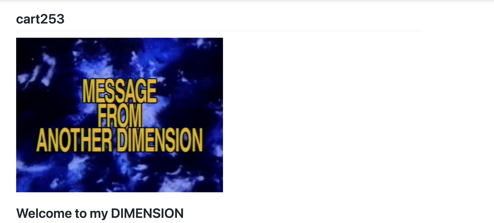
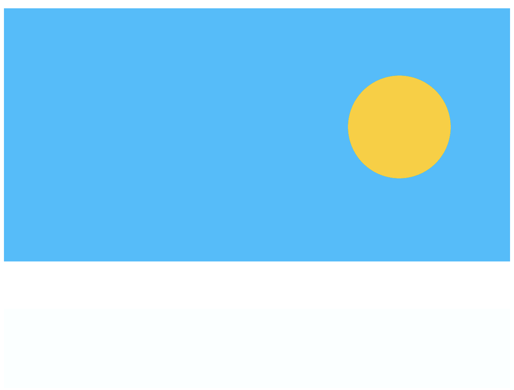

# *Reflective Journal* 
## 2026/09/14
I have worked on this project little by little. I have discovered how to apply my HTML knowledge to a complety new markup language. I find the visual appearance of Markdown as a website prettier than HTML. I was surprised that when you write Markdown syntax, it shows the result while working on Visual Studio Code.

The part that annoys me the most is changing the size of the image. I always have a problem with that. I tried to use width and height to resize my image, but nothing that I wrote worked. Some of the instructions were difficult for me to understand, but English isn't my first language, and that could explain why. For example, I didn't understand at first what a subsection was supposed to be on the website. It was only when I talked to one of my classmates that I understood it. I think for my next project, I will immediately ask for help on the Discord server when I get stuck with my coding, instead of researching on the Internet, which I found exhausting.

I hope in the future I will be able to use my creativity as a way to interact with my audience. I want my work to always be a shared experience that at least one person can relate to. At the end of the day, we are all part of the human race, and when something happens to us, it has happened to someone before. Isn't it beautiful to be understood?

## 2026/09/22
While making these three prototypes, I learned how changing variables can be used as a tool to express creative ideas. I found it cool to see how changing simple values could completely transform a simple drawing and make it more dynamic.
What surprised me the most happened while I was working on Keep the Pressure On. My original idea was to make the balloon grow while its color became lighter. However, when the balloon became extremely large, it started to take over the entire canvas. The background appeared pink and eventually white. This was not exactly what I had planned, but I found that it made the message about uncontrollable pressure more interesting.
I had another unexpected result while making Did You See the Time?. I used constrain() to control the changes in the colors of the sky, sun, and moon. However, the beach became much darker than I expected and seemed to disappear during the transition to day. It was not realistic, but I decided to keep it because it gave the scene an interesting atmosphere. It made me think about how some parts of an environment can disappear or become less visible as time changes.
Through these prototypes, I hope people can experience feelings that are not always pleasant, such as confusion or pressure, but are still part of life. If I developed these ideas further, I would focus more on the backgrounds and environments. I discovered that the background can become part of the story instead of only supporting the main subject.
