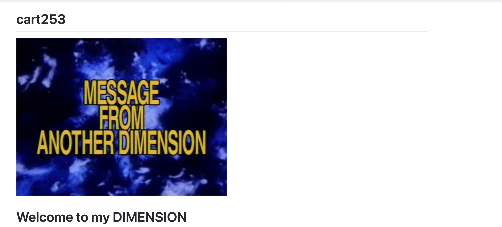
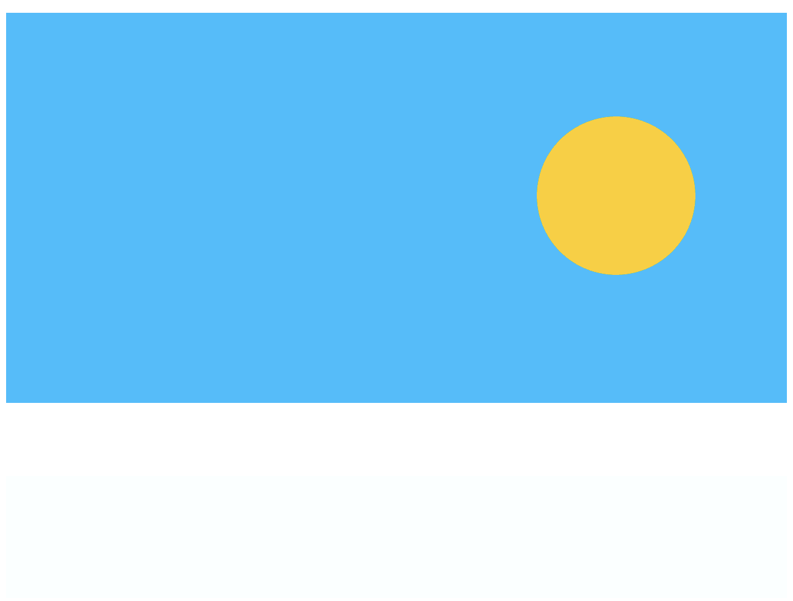
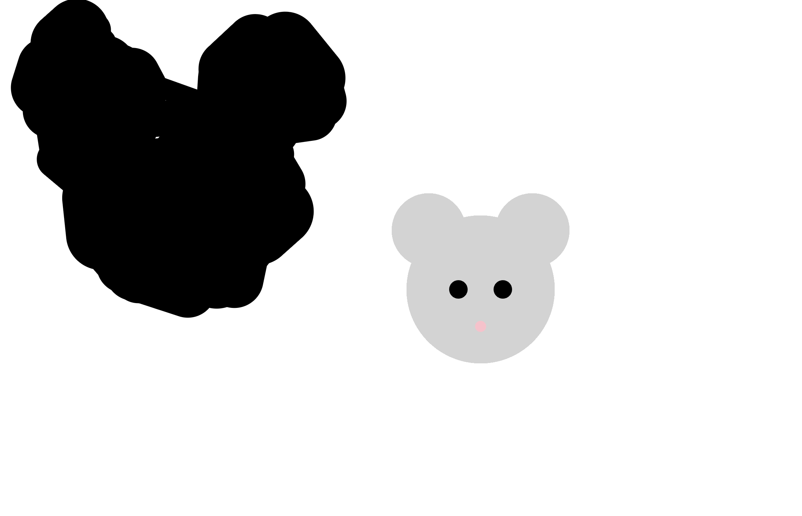
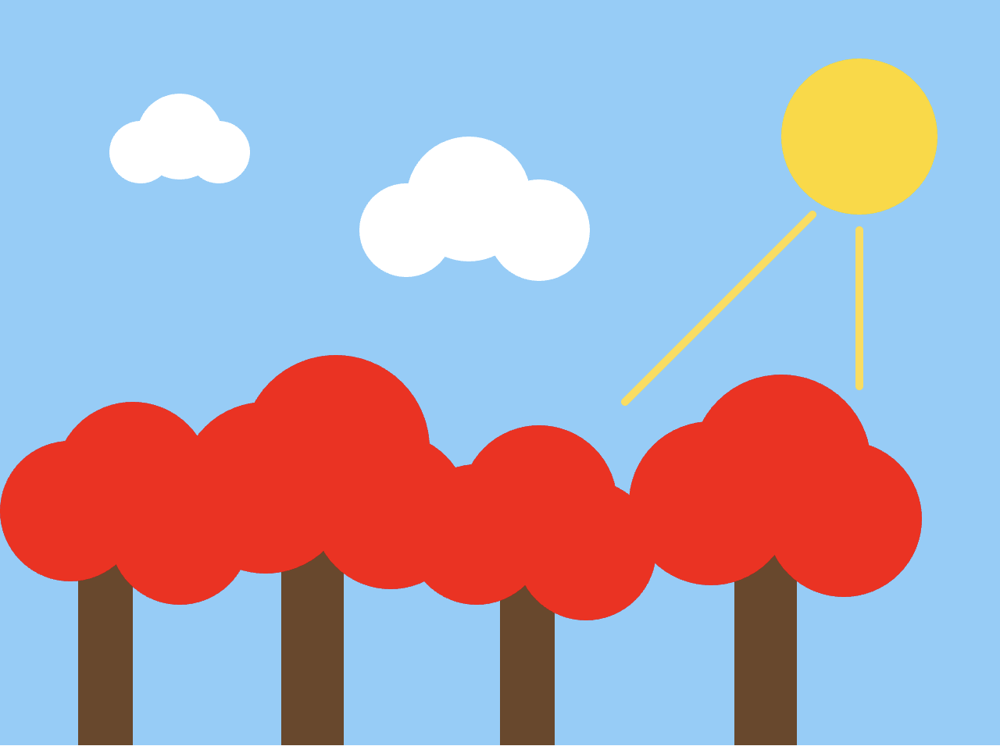
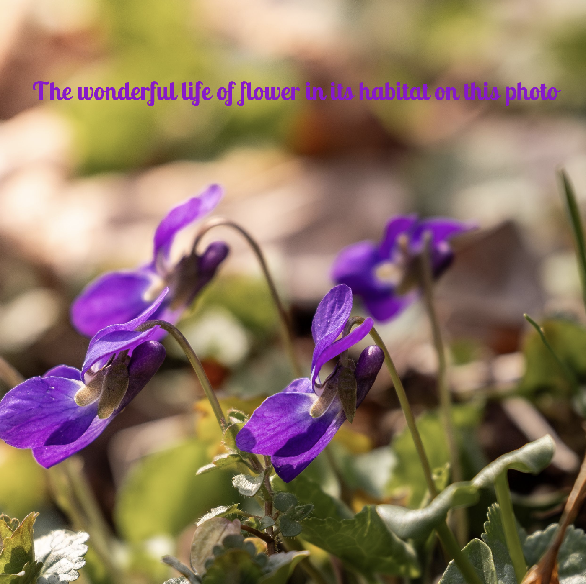
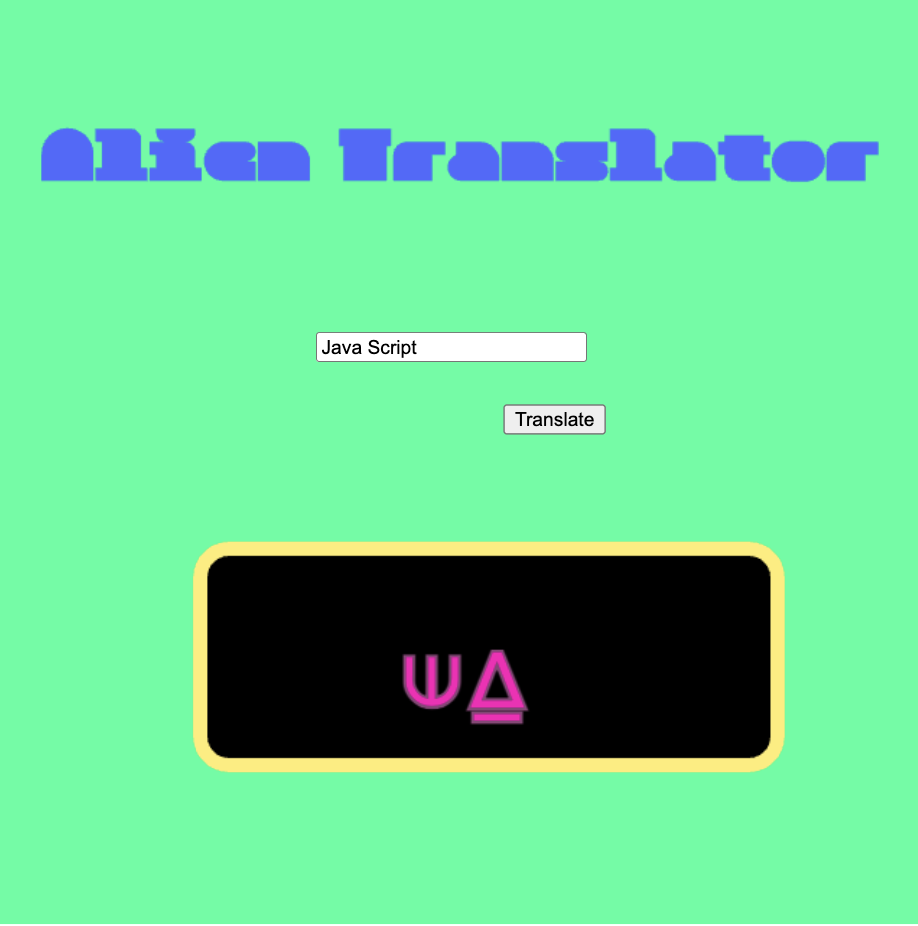

# _Reflective Journal_

## 2026/09/14

I have worked on this project little by little. I have discovered how to apply my HTML knowledge to a complety new markup language. I find the visual appearance of Markdown as a website prettier than HTML. I was surprised that when you write Markdown syntax, it shows the result while working on Visual Studio Code.

The part that annoys me the most is changing the size of the image. I always have a problem with that. I tried to use width and height to resize my image, but nothing that I wrote worked. Some of the instructions were difficult for me to understand, but English isn't my first language, and that could explain why. For example, I didn't understand at first what a subsection was supposed to be on the website. It was only when I talked to one of my classmates that I understood it. I think for my next project, I will immediately ask for help on the Discord server when I get stuck with my coding, instead of researching on the Internet, which I found exhausting.

I hope in the future I will be able to use my creativity as a way to interact with my audience. I want my work to always be a shared experience that at least one person can relate to. At the end of the day, we are all part of the human race, and when something happens to us, it has happened to someone before. Isn't it beautiful to be understood?

## 2026/09/22

While making these three prototypes, I learned how changing variables can be used as a tool to express creative ideas. I found it cool to see how changing simple values could completely transform a simple drawing and make it more dynamic.
What surprised me the most happened while I was working on Keep the Pressure On. My original idea was to make the balloon grow while its color became lighter. However, when the balloon became extremely large, it started to take over the entire canvas. The background appeared pink and eventually white. This was not exactly what I had planned, but I found that it made the message about uncontrollable pressure more interesting.
I had another unexpected result while making Did You See the Time?. I used constrain() to control the changes in the colors of the sky, sun, and moon. However, the beach became much darker than I expected and seemed to disappear during the transition to day. It was not realistic, but I decided to keep it because it gave the scene an interesting atmosphere. It made me think about how some parts of an environment can disappear or become less visible as time changes.
Through these prototypes, I hope people can experience feelings that are not always pleasant, such as confusion or pressure, but are still part of life. If I developed these ideas further, I would focus more on the backgrounds and environments. I discovered that the background can become part of the story instead of only supporting the main subject.

## 2026/09/29

Last week, I already trained myself to work with variables, so this week allowed me to push my skills further. I created three prototypes using new variables while also reusing what I had learned before.

My favourite prototype in terms of visuals was _Ad Out of Place_. It represents an advertisement about going to Mars because Earth is dying. However, while the ad is playing, the Sun grows until it takes over everything on the screen. I created this effect by continuously adding to the size of the Sun. I also experimented with random() to make the ad display shake around its original position. What surprised me was how changing simple numerical values could completely change the feeling of the scene. The shaking makes the environment feel unstable, while the growing Sun creates a sense that something uncontrollable is happening.

In _Do You Control It?_, I wanted the user to be directly involved. I changed the canvas size so that the activity takes up more space and used mouseX and mouseY to let the user try to reproduce a mouse that I had already drawn. However, they cannot reproduce it perfectly because the drawing tool is intentionally difficult to control. I experimented with random() and the stroke weight to reinforce this lack of control.

The most difficult part was understanding how to control movement without letting objects move completely away from their original positions. I would like to develop these experiments further by finding more ways to use variables to make the user's actions produce unexpected visual results.

## 2026/10/06

This week, I discovered conditional functions and used them as a tool for my new prototypes. I also continued some concepts from my previous projects, especially the passage of time and the feeling of having control over what happens on the screen.

The prototype that pleased me the most was the _Boom!_ project, but at the same time, it was the one I found the most annoying to make. The part that required the most work was the spark. I wanted it to move down the wick and stop when it reached the beginning of the bomb. At first, the spark did not correctly follow the line, or it disappeared behind the circle. At one point, I even created a spark that became wider and wider until it took over almost the whole screen. Even if this was not what I wanted, it was interesting to see how a small change in the code could completely change the result.

The rays of sunlight also took me time to control in my _Forest_ project. They either became too long or did not visually affect the leaves enough compared to the colour changes. To change the colour of the leaves, I created a sunlight variable and used several if and else if statements to check its value. When the sunlight reaches certain values, the leaves change to another colour. This helped me represent the change of seasons through interaction.

What surprised me about conditionals is how they allow me to reuse ideas from variables while organizing different possibilities in my program. I also find the interactive aspect interesting because the user can make choices that directly affect what happens. Through these prototypes, I hope people can see how their decisions can have an impact, from controlling a small creature like a fish to changing an entire season. In the future, I would like to use conditionals to make the user part of the story instead of only being an observer.

## 2026/10/20

Over the past two weeks, I have expanded my knowledge of conditionals by learning about events. They build on what we previously learned and introduce new ways for users to interact with a project, such as through the keyboard, mouse, or browser. I also discovered how to add custom fonts, sounds, and music to my projects, making them feel more alive and helping me express my ideas more clearly.

For these prototypes, I explored new concepts, focusing on gameplay for the first two projects and a more contemplative artwork for the last one.

In _Cooking Simulator_, the player has to cook an egg for the right amount of time to win the game. I used mouse events to allow the player to control the pan and cook the egg by holding down the mouse button. The player understands that the action is working when a frying sound starts playing.

The cooking process is represented by changes in the egg's colour. The yolk becomes yellow, while the egg white gradually turns golden brown. These changes depend on the score, which also acts as a timer. For example, below 5 points, the egg is still raw, while between 5 and 15 points, it is properly cooked. If the player continues cooking for too long, the egg becomes darker until it burns. The player loses if the egg is undercooked or overcooked, and the result appears on an ending screen after they release the mouse.

One difficulty I encountered was synchronizing the colour changes with the mouse interaction and the score. This exercise helped me understand how different variables and events can work together to create a functioning game. I also found it interesting how a simple action, such as holding down a mouse button, could create a feeling of pressure and responsibility.

On the other hand _Touch Grass_ project was more thoughtful and conceptual than practical. When I discovered window.addEventListener(), I started thinking about how the internet shapes our perception of reality. What we see online does not always represent what is real, and sometimes we need to disconnect to see things differently.

To express this idea, I drew a flower surrounded by shapes that resemble flames, creating the impression of danger in an environment where it does not belong. I chose grey because it creates a plain and lifeless atmosphere, where everything seems stagnant. I also added a dramatic message using a font that reminds me of serious or sad news, emphasizing the negative atmosphere.

However, when the user goes offline, the scene changes completely. A beautiful violet flower appears in a brighter environment. What previously looked like flames is revealed to be grass, which is actually part of the flower's natural surroundings. To emphasize this transformation, a peaceful nature sound begins playing. The message also changes to a more charming font, suggesting that there is still hope and that reality is not always as negative as it appears online.

One of my biggest difficulties was adding an image and adjusting its size to fit the canvas. I also struggled with triggering the sound through a browser event rather than a direct interaction with the canvas. This made me realize that events can create experiences that go beyond traditional mouse and keyboard interactions.

What I enjoyed most about learning events was discovering how they expand the possibilities of interaction. Unlike my previous projects, I can now create experiences where the user's actions have a more direct impact on what happens. At the same time, events can also be used in projects where the user is mainly an observer rather than an active participant.

I was surprised by how much these new functions allowed me to improve ideas I had explored since the beginning of the course. Some of my prototypes now feel closer to actual games that I would enjoy playing myself.

Through these projects, I hope people can first experience enjoyment and entertainment, especially through my mini-games. However, with Touch Grass, I want them to reflect on the importance of the real world and remember that life exists beyond what we see on the internet.

In the future, I would like to develop more interactive experiences where the user becomes the main character of their own journey, making decisions that influence the story instead of simply observing it.

# 2026/10/27

This week, I rediscovered the concept of functions and learned how they can expand my ability to create projects that I previously would have found difficult to code. Functions also helped me organize my code, reduce repetition, and make it easier to understand.

What surprised me the most was how quickly I could create multiple objects using functions. This was particularly useful in my Space Piano prototype. Instead of writing separate drawing instructions for every planet, I created a drawPlanet() function and called it with each planet's data. This made my code much more readable and easier to modify. I also used functions to generate stars in the background, allowing me to randomize their positions without rewriting the drawing instructions for each star.

The most challenging part of this week's work was understanding how to use functions with return values to generate data, especially in my final prototype, Alien Translator. I struggled to connect the HTML text input and button to my p5.js program because I wanted users to enter their own words and receive a fictional alien translation. I also discovered that positioning and styling HTML elements alongside a p5.js canvas required a different approach from drawing directly on the canvas. This project became an exercise in adaptation and problem-solving. By using randomized alien symbols and a function with a return value, I created a generator that produces fictional translations based on the user's interaction.

Beyond the technical aspects, I wanted each prototype to have its own artistic identity. For Space Piano, the arrangement of the planets inspired me to transform the solar system into a musical instrument. The visual changes when hovering over a planet make the interaction more intuitive and engaging.

In Spaceship, I decided to delay the beginning of the race so users would have time to choose which spaceship to support. Each spaceship has a different colour, making it easier to identify. By assigning random velocities, I made the outcome unpredictable, adding excitement to the competition.

Through these three projects, I hope users can rediscover some of the elements that make space fascinating: our solar system, spaceships, and the possibility of extraterrestrial life.

In the future, I would like to explore functions with parameters more deeply, not only to simplify my coding process but also to make more complex and interactive ideas easier to develop.

